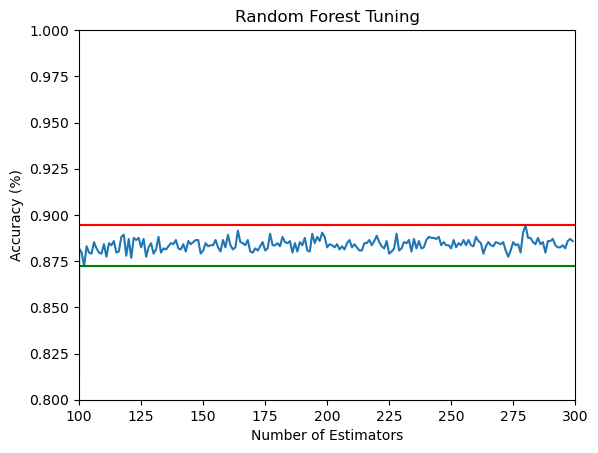
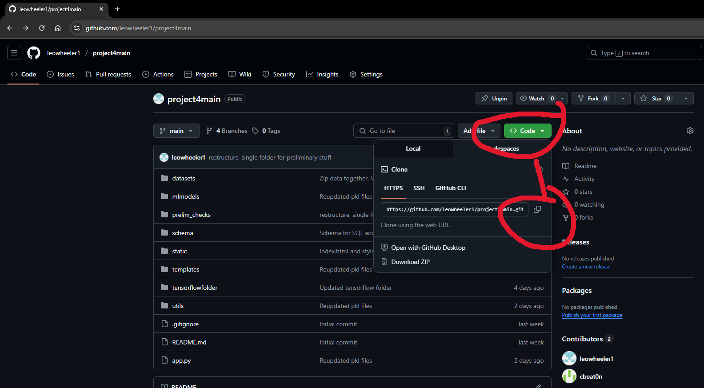
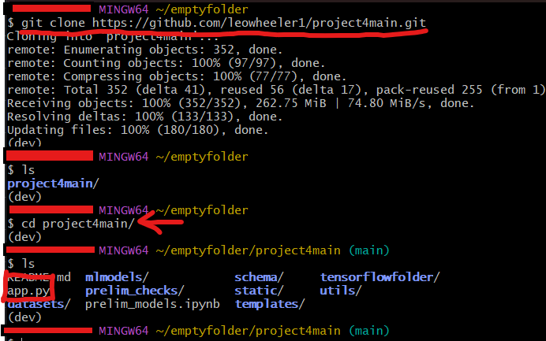
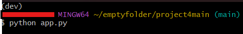
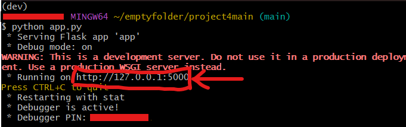
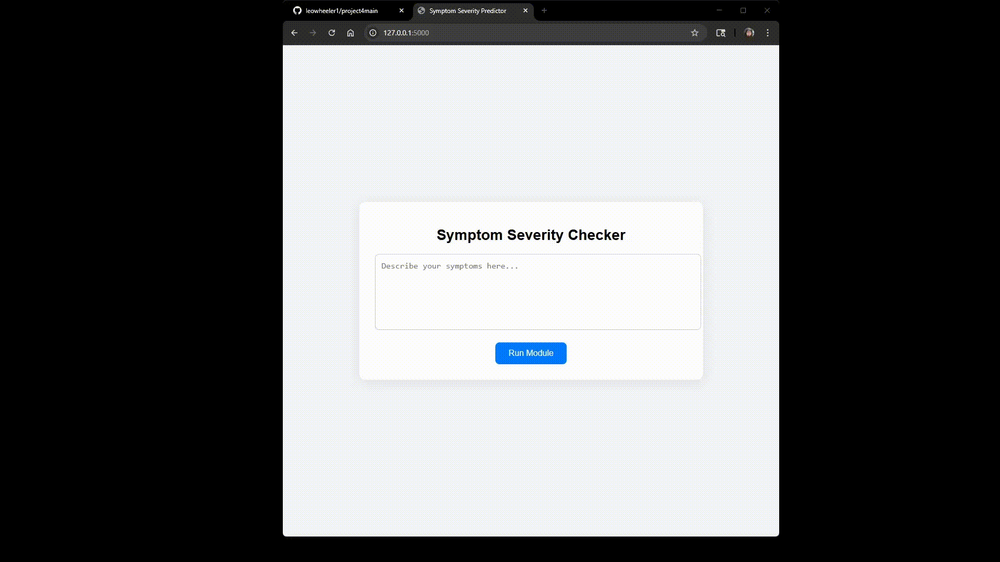

# Health Resource Chatbot

#  **This chatbot does *not* give medical advice. Please see a professional if you are having serious health concerns.**

## Repo Directory
#### [1. Datasets](datasets) - `.csv` files that were used to populate relational database and train ML models
#### [2. Images](images) - all images and gifs used in readme
#### [3. MLmodels](mlmodels) - all variations of model that were tested. trained models can be found here as well
#### [4. Prelim_Checks](prelim_checks) - preliminary testing to see if the idea was even possible
#### [5. Schema](schema) - setup for relational database
#### [6. Static](static) - `.css` file
#### [7. Templates](templates) - HTML page
#### [8. TensorFlow](tensorflowfolder) - deep learning neural network model
#### [9. Utils](utils) - chatbot and data transforming files
#### [10. README.md](README.md) - you are here
#### [11. app.py](app.py) - Flask app that runs the whole chatbot

## Project Overview
This project was to develop a chatbot that would take in symptoms from users and return a suggestion for approaching the symptoms. The goal of this chatbot is to help users decide on the urgency of medical scenarios. If symptoms are mild, and not indicitave of deeper, more serious issues, the bot may reccomend some rest and water. If the symptoms relate to dire situations, like apendicitis, the chatbot would encourage you to immediate leave for the emergency room. 

### Model Choice
Several different models were tested for this project. `XGBoost`, `Random Forest`, and `Deep Neural Network` all made the list, but the `Random Forest` outperformed all other models in consistency and accuracy. All tested models can be found in [mlmodels](mlmodels). The trained Random Forest model typically performs around `87-88%` accuracy, and can be found [here](mlmodels/trained_mlmodels).

### Model Training
All models went through rigorous training processes. `XGBoost` and `Random Forset` were tuned with custom tuning functions (seen in [here](mlmodels/trees.ipynb)) and both showed a similar result: more estimators led to a more accurate model. However, this seemed to plataeu around `100`, so in an effort to save on power, `200` was chosen as the ideal parameter for the number of estimators (image included below to show stagnant accuracy measurements). The `Deep Neural Network` was tuned using the `Keras Tuner` (as seen [here](tensorflowfolder/tensorflow.ipynb)). This tuning acheived a peak accuracy of about `87%`. All of the models were close, but the `Random Forest` remained most consistent, and became the model of choice. 

## Instructions for Use
### Cloning Repo
The first step to using this app is to clone the repo locally. Click the green `Code` button and then copy the link.

Next, in your terminal (Gitbash used in example), run the command `git clone <link>` to clone the repository locally. Once the repo has been cloned, be sure to move into the directory (`cd project4main` below).

Once in the right location in your terminal, run the command `python app.py` to start up the app.

Then, copy the link and paste it into your browser. 

From there, just type symptoms into the field, and watch as the model gives suggestions for treatment!

## References (Data)
- `symptom-disease-dataset` from user `dux-tecblic` on `HuggingFace.co`. Dataset can be found [here.](https://huggingface.co/datasets/dux-tecblic/symptom-disease-dataset)

## Other References
- [Blue Cross Blue Shield MN](https://www.bluecrossmn.com/find-care/when-visit-urgent-care-emergency-room-or-doctors-office ), used to help determine classes for classification

## Credits
    - Leo Wheeler
    - Jacob Brown
    - Liliana Guevara-Guerrero
    - Connor Beaton
